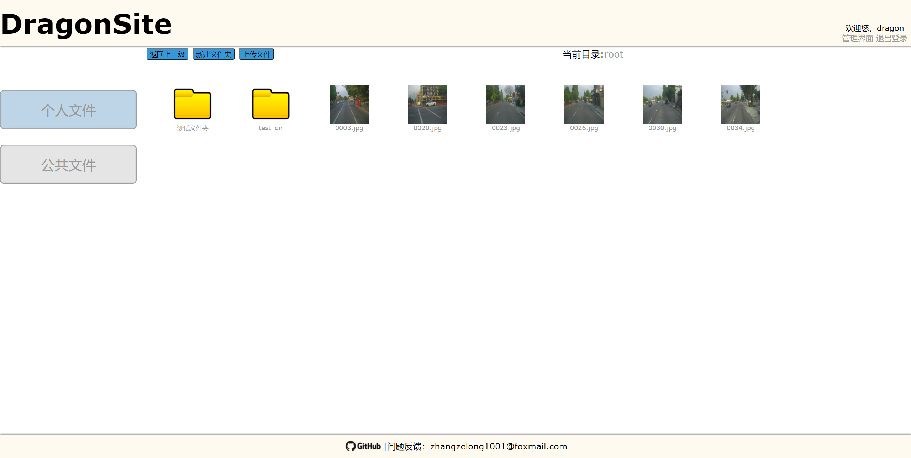
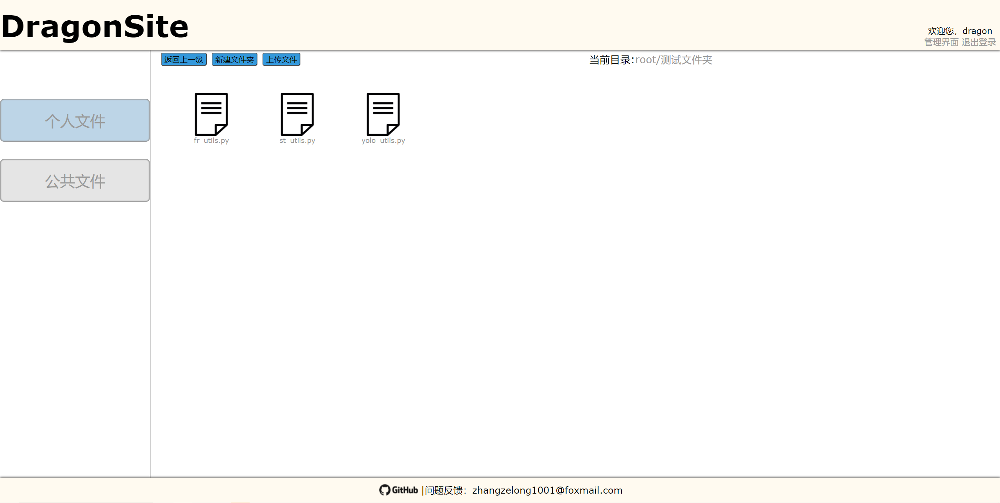

# DragonSite 

基于Django`3.2.4`的简易个人网盘

业余时间学习的Django框架，写了一个私人网盘。希望能与人交流一下有哪些不足。

目前已实现以下功能
-   [x] 文件上传，文件以md5作为唯一标识，只保存一份文件
-   [x] 新建文件夹
-   [x] 文件、文件夹删除、重命名
-   [x] 文件下载
-   [x] 图片以缩略图展示,缩略图缓存路径为`setting.CACHE_PATH`，可手动删除
-   [x] 简单设计的UI（前端写着是真费劲）
-   [x] 多用户管理与共享文件夹
-   [x] `视频` `图片`在新预览

后续有时间以及有兴趣的的话会添加以下功能
* 批量操作
* 移动
* UI美化

## 示例图片

`Example1`

`Example2`

## 安装说明

1.  克隆本仓库，`cd`至目标文件夹内
2.  `pip install -r requirement.txt` 安装所需包
3.  `python3 manage.py makemigrations netdisk` 和 `python manage.py migrate` 创建模型
4.  `python3 manage.py createsuperuser` 按提示输入用户名，邮箱（随意）和密码（小于8位的密码需再次确认）
5.  `python3 manage.py collectstatic` 收集所需静态文件至`STATIC_ROOT`
6.  `python3 manage.py runserver 0.0.0.0:8000` 即可运行服务（仅个人或小范围时使用此方法进行部署）

确认本机ip后，同一局域网下在浏览器中输入`<本机ip>:8000` 即可访问本站。

## 更新说明

v20210619

* 增加视频、图片的预览

v20210615

* 增加文件上传进度，大文件上传完成后需等文件全部写入完成后才会在页面显示
* 上传文件名中的空格会被删除

v20210611

*   因误删或其他原因导致实际md5文件与数据库记录不一致时，使用`Digest.digest_repair()`可以移除所有错误的记录和文件。
*   调整模型
*   验证文件名和文件夹名称中的空格，防止其导致无法识别url
